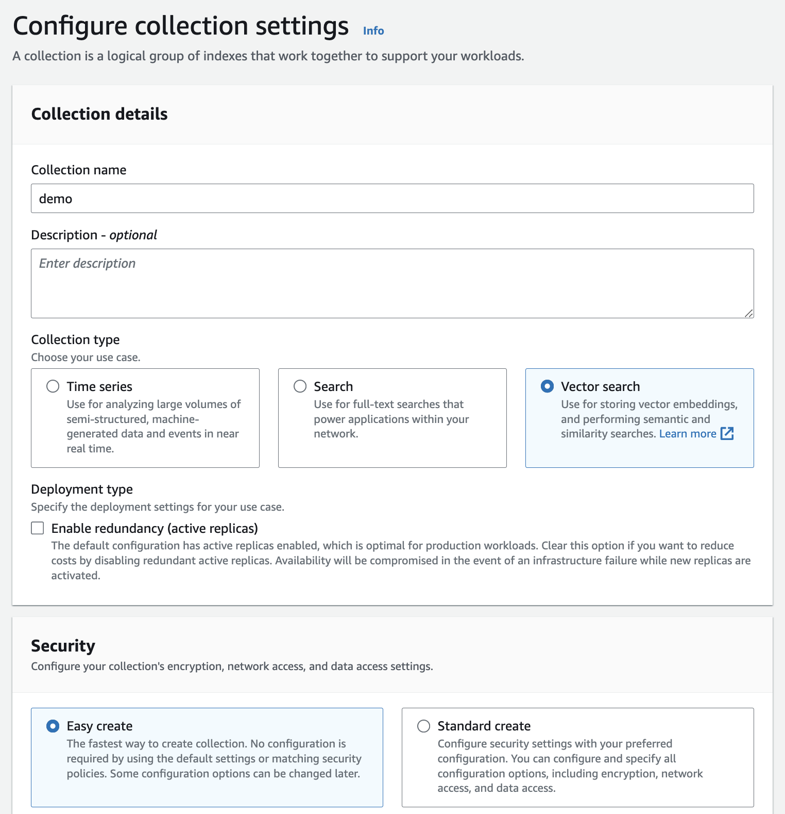
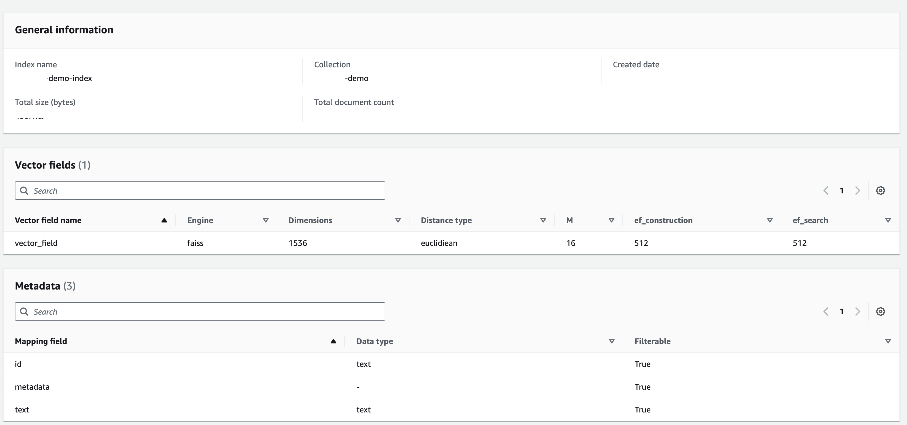
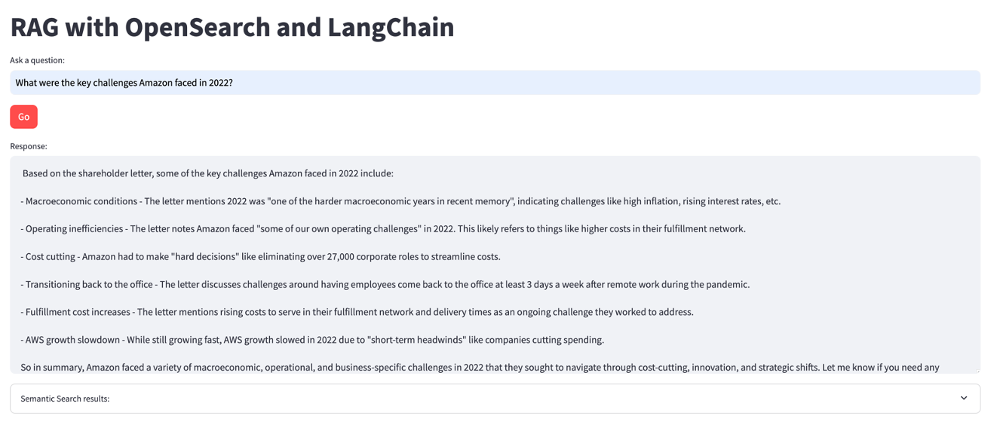

# Amazon OpenSearch and LangChain demos

## Before you start

- Make sure you have Python and [streamlit](https://docs.streamlit.io/get-started/installation) installed.
- Clone this repo

## Setup Amazon OpenSearch

Create an Amazon OpenSearch Serverless collection (type **Vector search** and choose **Easy create** option) - [documentation](https://docs.aws.amazon.com/opensearch-service/latest/developerguide/serverless-manage.html). 



Create an index with below configuration:



## Load data into OpenSearch

Download the [Amazon 2022 Letter to Shareholders](https://s2.q4cdn.com/299287126/files/doc_financials/2023/ar/2022-Shareholder-Letter.pdf) and place it in the same directory.

Create a `.env` file and provide the following info about your Amazon OpenSearch setup:

```bash
opensearch_index_name='<enter name>'
opensearch_url='<enter URL>'
engine='faiss'
vector_field='vector_field'
text_field='text'
metadata_field='metadata'
```

Make sure you have [configured Amazon Bedrock](https://docs.aws.amazon.com/bedrock/latest/userguide/setting-up.html) for access from your local machine. Also, you need access to `amazon.titan-embed-text-v1` embedding model and `anthropic.claude-v2` model in Amazon Bedrock - [follow these instructions](https://docs.aws.amazon.com/bedrock/latest/userguide/model-access.html) for details.

Load PDF data:

```bash
python3 -m venv myenv
source myenv/bin/activate
pip3 install -r requirements.txt

python3 load.py
```

> Verify data in OpenSearch collection

## Run Semantic search app

```bash
streamlit run app_semantic_search.py --server.port 8080
```

You can ask questions, such as:

```bash
What is Amazon's doing in the field of generative AI?
What were the key challenges Amazon faced in 2022?
What were some of the important investments and initiatives mentioned in the letter?
```


## Run RAG application

In a different terminal:

```bash
source myenv/bin/activate
streamlit run app_rag.py --server.port 8081
```

You can ask questions, such as:

```bash
What is Amazon's doing in the field of generative AI?
What were the key challenges Amazon faced in 2022?
What were some of the important investments and initiatives mentioned in the letter?
```


